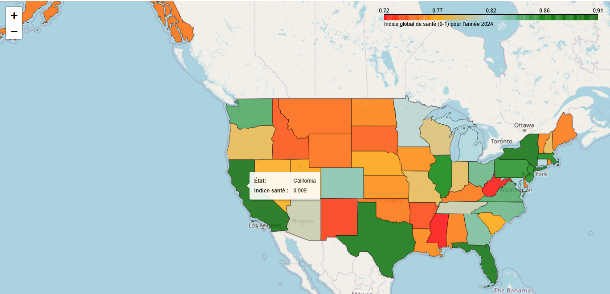
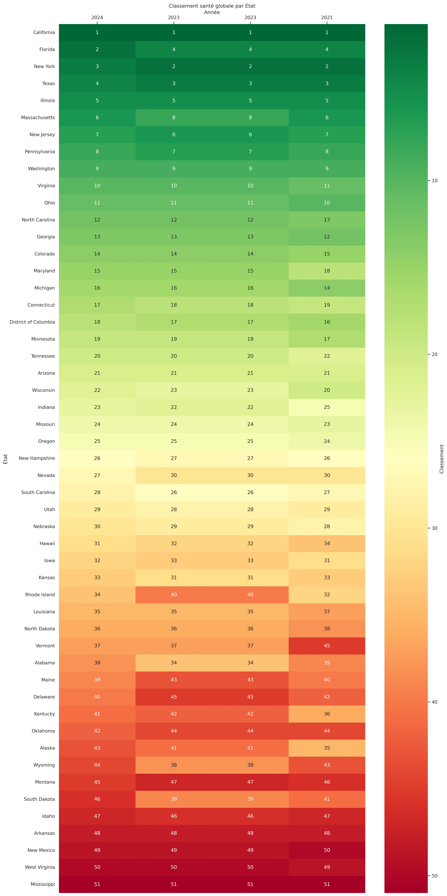
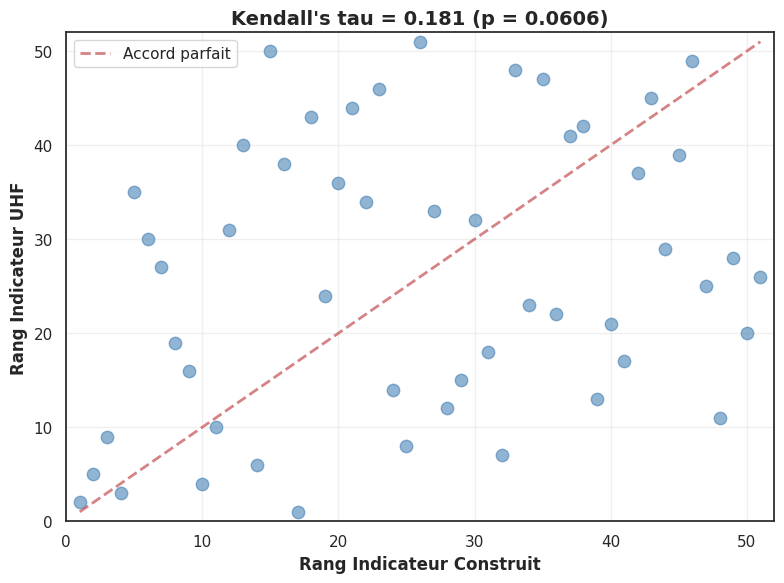

# Étude sur les facteurs qui déterminent la santé des enfants aux États-Unis
## Analyse statistique et évolution temporelle
[ Python pour la Data Science, 2A Ensae ]

Groupe TP n°5 
*Auteurs : Ina Campan, Rachel Issiakou, Samuel Romano*

## Table des matières

 1. [Revue de Littérature](#subheading-1)
 2. [Sujet et problématique](#subheading-2)
 3. [Bases de données](#subheading-3)
 4. [Visualisation des données et modélisation](#subheading-4)
 5. [Navigation au sein du projet](#subheading-5)
 6. [Résultats principaux et conclusions](#subheading-6)

## Revue de Littérature <a name="subheading-1">

La santé des enfants constitue un déterminant central de la santé à l’âge adulte. Les conditions de santé, de nutrition et de soins durant l’enfance influencent durablement le développement physique, cognitif et social. Aux États-Unis, la recherche en santé publique s’est largement concentrée sur la population générale, tandis que la santé des enfants et des adolescents fait l’objet d’une attention plus limitée et souvent fragmentée. Cette revue de littérature s’inscrit dans ce contexte et vise à synthétiser les principaux résultats existants sur la santé des moins de 18 ans aux États-Unis.

### État de santé des enfants aux États-Unis

Selon Forrest et al. (2025) et le rapport de l’UNICEF sur le bien-être des enfants (2013), les indicateurs de santé des enfants se sont globalement dégradés aux États-Unis au cours des dix-sept dernières années. Trois dimensions principales ressortent de la littérature : la mortalité, les maladies chroniques et l’obésité.

La mortalité infantile et juvénile demeure nettement plus élevée aux États-Unis que dans les autres pays de l’OCDE. Les nourrissons et les enfants âgés de 1 à 19 ans présentent un risque de décès supérieur à la moyenne de l’OCDE. Pour les enfants de moins d’un an, ce risque est supérieur de 78 %. La mortalité infantile est principalement liée aux naissances prématurées, tandis que chez les enfants plus âgés, les décès de cause médicale sont majoritairement associés aux suicides.

La prévalence des maladies chroniques chez les enfants et les adolescents a également augmenté, passant de 25,8 % en 2011 à 31 % en 2023. Cette évolution s’explique en grande partie par la hausse des troubles de santé mentale, en particulier les diagnostics de dépression et d’anxiété.

Enfin, l’obésité infantile a progressé de manière continue sur la période considérée. Le taux d’obésité est passé de 17,0 % en 2007 à 20,9 % en 2023, confirmant une tendance durable à la hausse.

### Indices de santé et de bien-être 

Le rapport de l’UNICEF et l’étude publiée dans le Journal of the American Medical Association (JAMA), l’une des principales revues scientifiques en médecine et en santé publique, reposent sur des approches comparables visant à mesurer et comparer la santé et le bien-être des enfants dans les pays à haut revenu.

L’UNICEF utilise un cadre multidimensionnel du bien-être, dont la santé constitue l’une des cinq dimensions. Cette dimension est mesurée à partir de plusieurs indicateurs : la mortalité infantile, la part des naissances de faible poids, les taux de vaccination (rougeole, polio et DTP3) ainsi que la mortalité des enfants et adolescents âgés de 1 à 19 ans. Pour chaque dimension, un score est calculé comme la moyenne des indicateurs correspondants. Le classement final repose sur la moyenne des scores obtenus dans l’ensemble des dimensions, ce qui permet de comparer le bien-être des enfants dans 29 pays à haut revenu. Dans ce classement global, les États-Unis occupent le 24ᵉ rang.

L’étude du JAMA s’appuie sur la combinaison de plusieurs enquêtes nationales représentatives menées aux États-Unis, notamment le NHANES, le NHIS, le NSCH, le PSID et le YRBS. Ces enquêtes reposent sur les déclarations des parents ou des enfants et adolescents eux-mêmes. Les comparaisons internationales sont principalement réalisées à l’aide de rapports de taux (rate ratios, RR), qui mesurent le rapport entre la fréquence d’un événement de santé dans deux populations. Par exemple, un rate ratio de mortalité compare le taux annuel observé aux États-Unis à celui observé en moyenne dans les pays de l’OCDE.

### Choix de la base de données principale

À partir de ces références, nous avons retenu la base NSCH, qui répond au critère d’accessibilité en ligne. Elle présente également l’avantage de couvrir l’ensemble des groupes d’âge des enfants et adolescents de moins de 18 ans.

### Références :

1. Forrest, C. B., Koenigsberg, L. J., Eddy Harvey, F., Maltenfort, M. G., & Halfon, N. (2025). Trends in US Children's Mortality, Chronic Conditions, Obesity, Functional Status, and Symptoms. JAMA, 334(6), 509–516. https://doi.org/10.1001/jama.2025.9855
2. Centre de recherche de l’UNICEF, 2013, « Le bien-être des enfants dans les pays riches : vue d’ensemble comparative », Bilan Innocenti 11, Centre de recherche de l’UNICEF, Florence. 

## Sujet et problématique <a name="subheading-2">

Dans ce projet, nous proposons de construire un indice synthétique de santé des enfants à l’échelle des États américains, à partir des données issues de la base NSCH. Notre objectif est de développer un indicateur multidimensionnel intégrant simultanément plusieurs dimensions de la santé : la santé physique, la santé mentale et la santé économique.

Cet indice vise à permettre l’identification de disparités géographiques entre les États, l’analyse des évolutions temporelles d’une année à l’autre, ainsi que la comparaison de nos résultats avec ceux d’autres indices de santé ou de bien-être existants.

## Bases de données <a name="subheading-3">

I. Le **[NSCH](https://www.census.gov/programs-surveys/nsch/data/datasets.html)** (National Survey of Children’s Health) est une enquête auprès des ménages qui produit des données nationales aux États-Unis sur la santé physique et émotionnelle des enfants âgés de 0 à 17 ans. L’enquête recueille des informations liées à la santé et au bien-être des enfants, notamment l’accès et le recours aux soins de santé, les interactions familiales, la santé des parents, les expériences scolaires et extrascolaires, ainsi que les caractéristiques du quartier de résidence. Depuis 2016, le NSCH est une enquête annuelle. L’enquête fournit des estimations nationales chaque année et des estimations au niveau des États en combinant 2 ou 3 années de données. Avant 2016, l’enquête était réalisée tous les 4 ans.

II. **[Les données géographiques](https://www.census.gov/geographies/mapping-files/time-series/geo/cartographic-boundary.html)** permettent de tracer sur un fond de carte des différents États américains des résultats issus de la base de données antérieure.

III. **[Les données économiques](https://apps.bea.gov/regional/downloadzip.htm)** permettent d'obtenir un indice synthétique plus fiable au niveau des état Américains. Le BEA (Bureau of Economic Analysis) est l’agence officielle américaine qui mesure l'activité économique : PIB, revenu, commerce, productivité, comptes régionaux, etc. Elle produit des données standardisées, fiables et comparables dans le temps, utilisées par le gouvernement, les chercheurs et les institutions internationales.

IV. **[Les données d'America's Health Rankings](https://www.americashealthrankings.org/publications/articles/state-rankings-since-1990)** fournissent des indicateurs de santé agrégés au niveau de chaque État américain depuis 1990. Le classement général des États est établi à partir de divers indicateurs répartis en cinq catégories liées à la santé : facteurs sociaux et économiques, environnement physique, comportements, soins cliniques et résultats en matière de santé.

## Visualisation des données et modélisation <a name="subheading-4">

Pour construire l’indicateur de santé, nous procédons à une sélection de variables organisées en plusieurs dimensions complémentaires. Celles-ci couvrent la santé physique, la santé mentale, l’environnement familial et la situation économique du ménage.

Pour traiter les valeurs manquantes, lorsqu’elles ne sont pas dues à la structure du questionnaire le cas échéant, nous utilisons une imputation en utilisant la fonction ```KKNImputer``` de la librairie scikit-learn. Les valeurs manquantes de l'échantillon sont imputées en utilisant la valeur moyenne des ```n_neighbors``` plus proches voisins trouvés dans l’ensemble.

Pour comprendre la structure des données, nous réalisons plusieurs analyses : analyses des correspondances multiples, cartes de chaleur des corrélations (heatmaps), analyses en composantes principales (ACP), ainsi que des visualisations graphiques telles que boxplots, violinplots ou barplots.

L’indice de santé, normalisé sur un intervalle de 0 à 1 (plus la valeur est élevée, meilleure est la santé), est construit en s’inspirant de l’indice de développement humain, sous la forme d’une moyenne géométrique de trois dimensions, comme mentionné précédemment. Les sous-indicateurs sont calculés soit comme des moyennes simples, soit comme des moyennes pondérées, en utilisant comme pondération les charges factorielles de chaque variable issues des ACP.

## Navigation au sein du projet <a name="subheading-5">

La fichier qui décrit l'ensemble des analyses et des résultats est "Determinants_of_children-s_health.ipynb".

Dans un terminal (depuis le dossier ```Determinants_of_children-s_health``` -- faire ```cd Determinants_of_children-s_health``` si nécessaire), commencez par la commande : 
```bash
pip install -r requirements.txt 
```

Les fonctions annexes sont regroupés dans le dossier ```script```.

Pour s'y prendre une documentation est également fournie en format html dans le dossier ```docs```. 
```bash
pdoc --output-dir docs script
```

Pour une approche plus interactive de la documentation, dans le terminal commencez par la commande :
```bash
pdoc script 
```

Maintenant, vous pouvez parcourir le notebook dans son intégralité.

## Résultats principaux et conclusions <a name="subheading-6">

Dans la construction de nos indicateurs, nous avons remarqué que ceux-ci sont situés dans des intervalles parfois étroits. Même les valeurs extrêmes restent proches du centre, ce qui confirme une faible variabilité globale.


Via une carte interactive, on visualise les indicateurs au niveau de chaque État. Visuellement, les États en meilleure santé se situent sur la côte Est des États-Unis (New York, Pennsylvanie). On observe également une validation de la première loi de la géographie de Waldo Tobler : « Tout est lié à tout le reste, mais les choses proches sont plus liées que les choses éloignées. » Effectivement, sur la côte Est, plusieurs États en « bonne santé » sont des voisins, tandis que la santé se dégrade petit à petit vers le centre des États-Unis.



Au fil des années, nous n’observons pas de grands gains ou pertes dans le classement généré par l’indicateur global. Les États qui étaient en très bonne santé au début de 2021 le sont toujours en 2024, et il en va de même pour les États les moins bien classés. Certains États ont cependant connu des variations plus importantes, comme Rhode Island, qui a gagné 5 places entre 2023 et 2024, ou à l’inverse South Dakota, qui en a perdu 7 sur la même période.




Pour comparer le classement donné par notre indicateur et celui donné par l'indicateur de la United Health Fondation, nous utilisons le tau de Kendall. Le tau de Kendall mesure l’association entre deux classements en comparant toutes les paires d’observations : une paire est dite concordante si l’ordre est le même dans les deux classements, discordante sinon. Le coefficient est calculé comme la différence entre le nombre de paires concordantes et discordantes, rapportée au nombre total de paires (avec des ajustements possibles en cas d’ex æquo). Il varie entre −1 (classements opposés) et +1 (classements identiques). Son principal intérêt est qu’il ne dépend que des rangs : il permet donc de comparer deux classements même lorsque les variables sont mesurées sur des échelles différentes ou non linéaires, et il est robuste aux valeurs extrêmes.

La grande dispersion des points sur le graphique, la faiblesse du tau de Kendall (0.181) et une p-value qui nous permet de rejeter l'hypothèse nulle (il n’existe aucune association monotone entre les deux variables) montre que les indicateurs donnent des classements faiblement corrélés. Cette différence peut s'expliquer par des choix de variables ou de pondération différents. Par ailleurs, nous comparons différentes régions d'un pays très développé où, en comparaison au reste du monde, les dépenses de santé sont élevées à peu près partout. Si nous comparions des pays avec des PIB très différents, nous devrions obtenir des classements similaires avec les deux indicateurs.



Il ne nous semble pas pertinent de régresser un indicateur sur un autre car le calcul du tau de Kendall et la visualisation des classements dans l'espace invalident l'hypothèse d'une relation linéaire entre les deux indicateurs.